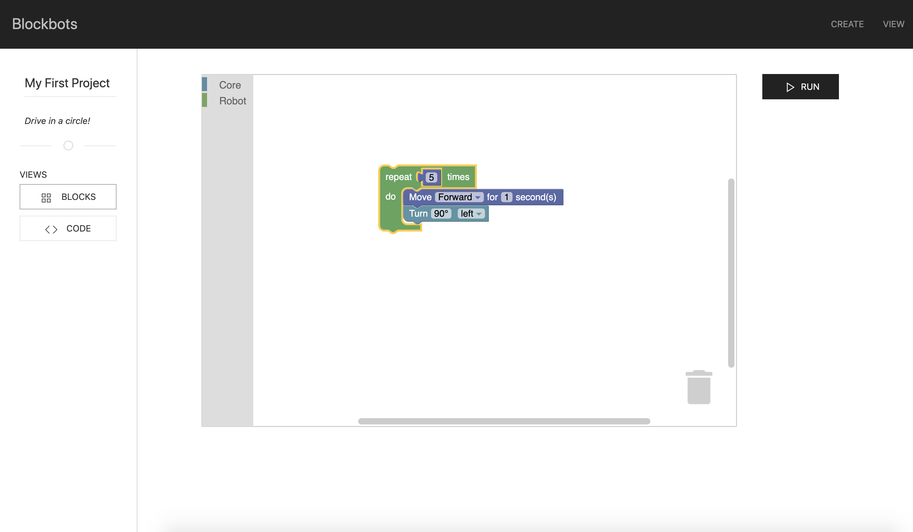

*A high-level visual programming framework for robotics*

For the CS50 Final Project, I developed the front-end portion of this project. It can output the instructions as JSON, which can be easily integrated into any simple, internet-connected robot project.

## Problem
Blockbots aims to help educate people about programming through interaction with the real world. The gap between play-along tutorials/Scratch and abstract command-line based programs can be daunting, and many people do not know what programming actually does - escaping the trope of a hacker and a black and green terminal can be difficult. Thus, Blockbots not only seeks to help educate people about programming, but close the distance between perception and reality of programming in the eyes of the general public.

## Solution
Blockbots is a flexible front-end web interface for use with IOT-enabled robots. The main way Blockbots approaches this problem is through a visual programming interface with side-by-side Python code comparison, allowing the user to see how what they program translates to actual code in real time. They can then send their program to a compatible robot to see their code in action.
## Features
- Write visual code using Google's Blockly API
- Switch to the Python view to see how your program compares to actual code
- Send your program to a compatible robot on your local network
- View all queued programs for a robot and run them one at a time

## Screenshots
---

  
  

