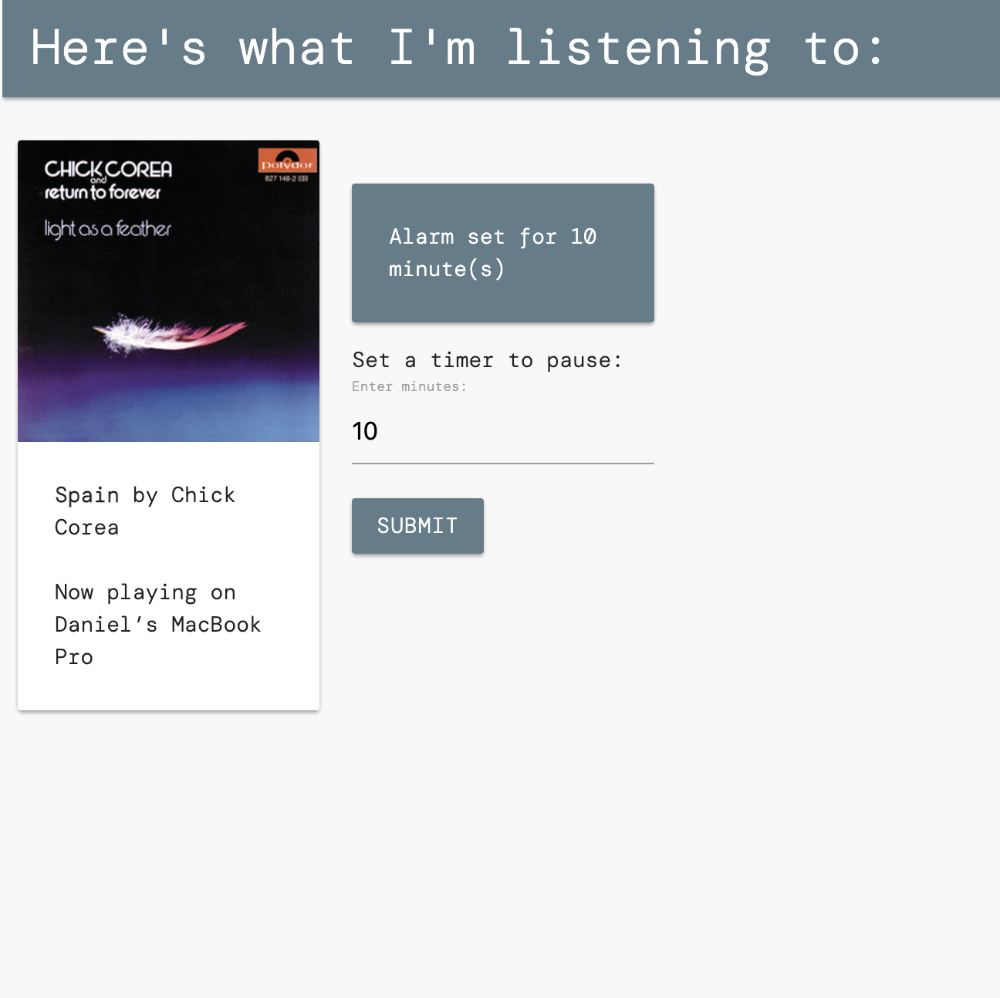

A local Flask web app allowing you to view playing songs and set a timer for them to stop.

I found this extremely useful until I realized Spotify had this feature built-in. Oh well.

Utilizes the Spotify Web API and Spotipy wrapper alongside Materialize CSS framework.

## Usage
Set environment variables for `SPOTIPY_CLIENT_ID`, `SPOTIPY_CLIENT_SECRET`, and `SPOTIPY_REDIRECT_URI`

## Dependencies
- Spotify premium
- Spotipy package (2.12.0)
- Flask, flask-wtf, and wt-forms
- Materialize

## Screenshots
---

